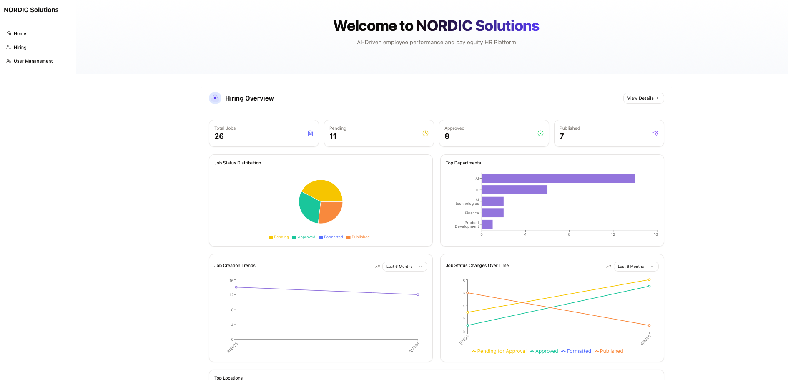
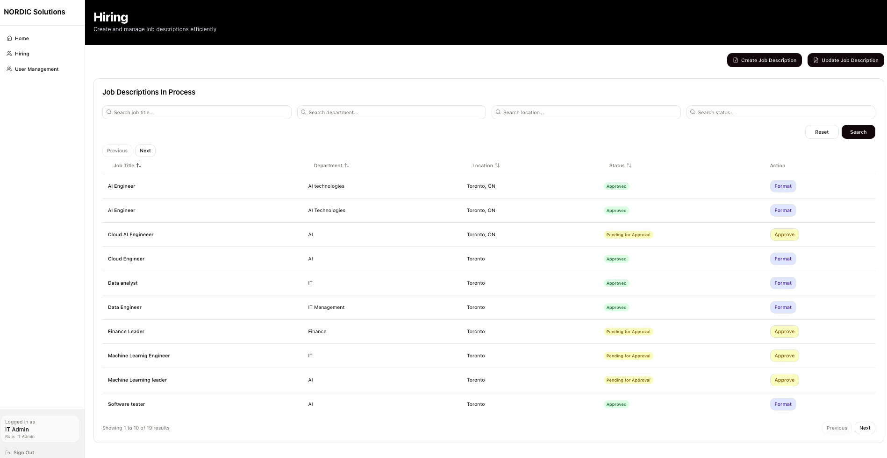
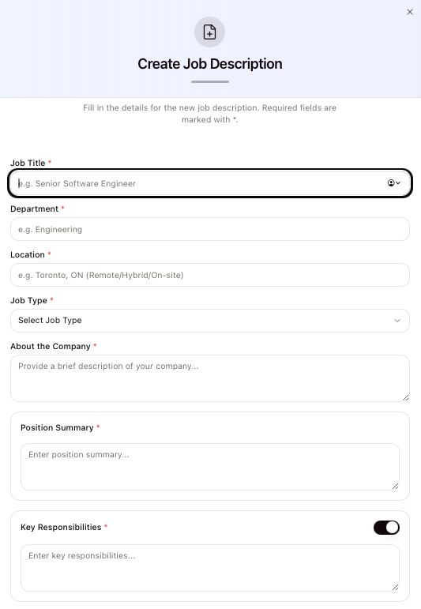
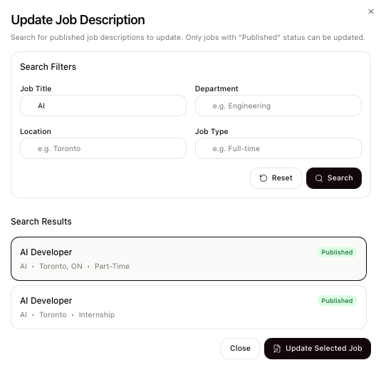
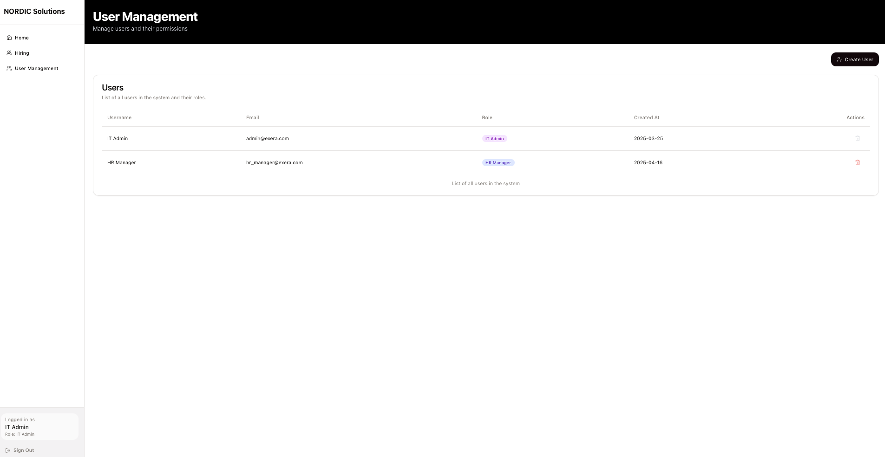

# AI-Driven HR Platform



## 📋 Overview

AI-Driven HR Platform is a comprehensive job description management system designed to streamline the process of creating, editing, and publishing job descriptions while ensuring they are free from unconscious bias. The platform leverages AI to analyze job descriptions and provide recommendations to make your hiring process more inclusive.

## ✨ Key Features

- **User Role-Based Access Control**: Different interfaces for IT Admins, HR Managers, and HR Assistants
- **AI-Powered Bias Analysis**: Detects potential bias in job descriptions using Google's Gemini AI
- **Job Creation & Management**: Intuitive interface for creating and editing job descriptions
- **User Management**: For IT Administrators to manage system users
- **Responsive UI**: Works seamlessly across desktop and mobile devices






## 🏗️ Project Architecture

The application follows a modern client-server architecture:

### Frontend

- React.js with TypeScript
- Tailwind CSS for styling
- Shadcn UI component library
- React Query for data fetching and state management

### Backend

- Node.js with Express
- MongoDB for data storage
- JWT Authentication
- Google Gemini AI API integration for bias analysis


## 🛠️ Technologies Used

### Frontend


### Backend


## 📸 Screenshots

### User Management


_IT Admins can manage users, set roles, and control access permissions._

### Job Description Creation


_Intuitive interface for creating comprehensive job descriptions._

### Bias Analysis


_AI-powered bias detection helps create more inclusive job descriptions._

### Navigation Experience


_User-friendly navigation based on role permissions._

## 🚀 Installation & Setup

### Prerequisites

- Node.js (v18 or higher)
- MongoDB (v4.4 or higher)
- Google Gemini API key

### Frontend Setup

```bash
# Clone the repository
git clone https://github.com/your-username/exera-solutions.git

# Navigate to frontend directory
cd Exera/Frontend/client

# Install dependencies
npm install

# Start development server
npm run dev
```

### Backend Setup

```bash
# Navigate to backend directory
cd Exera/Backend

# Install dependencies
npm install

# Create .env file (see ENV_SETUP.md for details)
cp ENV_SETUP.md .env
# Edit .env file with your credentials

# Start development server
npm run dev
```

## 🔑 Environment Variables

See [ENV_SETUP.md](./Backend/ENV_SETUP.md) for detailed environment variable configuration.

## 📖 Usage Guide

### User Roles

1. **IT Admin**:

   - Manage users (create, edit, delete)
   - Access all system features
   - Configure system settings

2. **HR Manager**:

   - Create and edit job descriptions
   - Review and approve job descriptions
   - Publish job descriptions externally

3. **HR Assistant**:
   - Create draft job descriptions
   - View job descriptions
   - Run bias analysis

### Creating a Job Description


1. Log in with your credentials
2. Navigate to "Hiring" section
3. Click "Create Job Description"
4. Fill in required fields
5. Optionally run AI bias analysis
6. Submit for approval or save as draft

## 🤝 Contributing

Contributions are welcome! Please feel free to submit a Pull Request.

1. Fork the repository
2. Create your feature branch (`git checkout -b feature/amazing-feature`)
3. Commit your changes (`git commit -m 'Add some amazing feature'`)
4. Push to the branch (`git push origin feature/amazing-feature`)
5. Open a Pull Request

## 👥 Team

- [Rodolfo Borbon] - Fronttend Developer

## 🙏 Acknowledgements

- [Shadcn UI](https://ui.shadcn.com/) for the beautiful UI components
- [Google Gemini AI](https://ai.google.dev/) for powering our bias analysis
- Centennial College for project guidance and support
